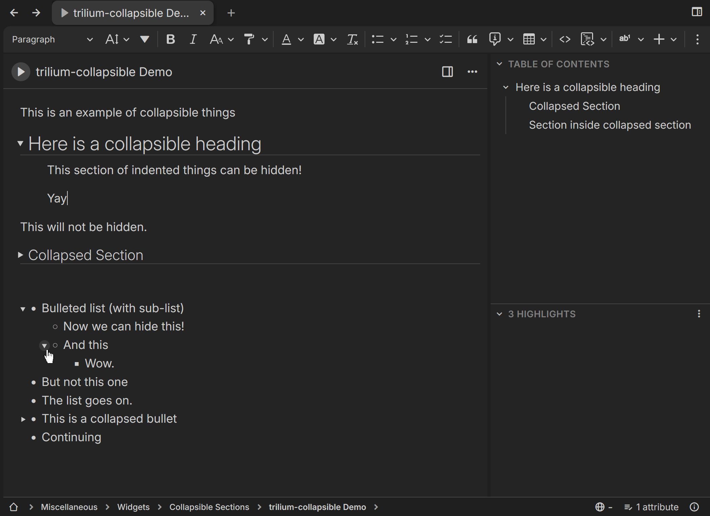
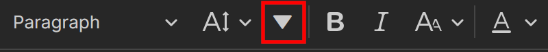

# trilium-collapsible
A widget to enable collapsible sections and bullet points in Trilium.  
*(Tested in TriliumNext v0.101.1)*

## Features
**Collapsible Sections and Lists**


**Collapsibility Toggle (for headings)**


* A button has been added to the text-editing toolbar to toggle collapsibility for the heading targeted by the cursor. Collapsible headings can be distinguished by an arrow that appears to the left of them, indicating whether it is collapsed or expanded.
    * Collapsible headings can show/hide the section that immediately follows them.
    * A section consists of elements with an indent level greater than their header.
    * An option exists to make all headings collapsible, instead of toggling individually.
* If collapsible bullets are enabled, all bullet points with a sub-list may be clicked to toggle its visibility.

Some elements (like code blocks) don't play well with my indent-based section implementation, as they don't maintain an indent level. So I made their behavior dependent on the line before them.

But for those of you who would mostly use this to hide text (like me!), this won't be too big of a problem. Images should work fine, and other odd elements will be okay if you put a properly indented line right before them.

## Why this?
When I first switched to Trilium from other note-taking apps (Notion, Obsidian, etc.), this was one of the key features I missed. And it turns out I was not alone:  
https://github.com/TriliumNext/Trilium/issues/947
https://github.com/TriliumNext/Trilium/issues/1850

However, because CKEditor (Trilium's text editor) sanitizes its HTML, typical methods of applying custom styles to the frontend (like adding a class) don't persist upon reloading the note. A widget attempting this implemention for collapsible bullets can be found [here](https://github.com/TriliumNext/Trilium/issues/1850#issuecomment-1734283248). But this gets cumbersome if there are big sections that you want to keep collapsed for navigation, as you would have to re-collapse them every time you open the note.

This did not discourage me, however, and I eventually found a narrow workaround within the confines that I am aware of, using comments to trojan horse data into the inline styles of elements.

This is my first Trilium widget, so I'm not that deep into what's possible with the API or CKEditor, but I can't see very many other ways to get this working persistently.

If you have ideas for how to improve a feature or implement a new one, please feel free to suggest them!

## Installation
1. Create a code note of type `JS frontend`
2. Copy the contents of trilium-collapsible.js into the note
3. Give the note the label `#widget`
4. Optionally add these labels to enable UI-friendly options if you don't like the default behavior:
```
#label:doCollapsibleHeaders="promoted,alias=Collapsible Headings,single,boolean" #doCollapsibleHeaders=true 
#label:doCollapsibleLists="promoted,alias=Collapsible Lists,single,boolean" #doCollapsibleLists=true 
#label:indentImages="promoted,alias=Try to Indent Images,single,boolean" #indentImages=true 
#label:indentUnhandled="promoted,alias=Try to Indent Special Elements,single,boolean" #indentUnhandled=true 
#label:considerListsIndented="promoted,alias=Consider Lists Indented,single,boolean" #considerListsIndented=true 
#label:indentLevels="promoted,alias=Supported Indent Levels,single,number" #indentLevels=10 
#label:toolbarButtonPosition="promoted,alias=Toolbar Button Position,single,number" #toolbarButtonPosition=2
#label:allHeadersCollapsible="promoted,alias=All Headings Collapsible,single,boolean" #allHeadersCollapsible=false 
#label:minimalCollapsedHeaders="promoted,alias=Minimal Collapsed Headings,single,boolean" #minimalCollapsedHeaders=false
#label:minimalCollapsedLists="promoted,alias=Minimal Collapsed Lists,single,boolean" #minimalCollapsedLists=false 
#label:dynamicListIndicator="promoted,alias=Dynamic List Indicator,single,boolean" #dynamicListIndicator=false
#label:showListSectionLines="promoted,alias=Show List Section Lines,single,boolean" #showListSectionLines=false 
#label:collapsedIndicatorColor="promoted,alias=Collapsed Indicator Color,single,color" #collapsedIndicatorColor="#80e0e0"
#label:useCollapsedIndicatorColor="promoted,alias=Use Collapsed Indicator Color,single,boolean" #useCollapsedIndicatorColor=false
#label:addKeyProtections="promoted,alias=Enter & Delete Protections,single,boolean" #addKeyProtections=true 
#label:usingOldLayout="promoted,alias=Using Old UI Layout,single,boolean" #usingOldLayout=false 
```
5. Optionally add this label to enable functionality on mobile: `#run=mobileStartup`
6. Reload Trilium

## Options
* **Collapsible Headings (default: on) -** Toggle all collapsible heading & section functionality. (hidden items will be shown again)
* **Collapsible Lists (default: on) -** Toggle all collapsible list functionality. (hidden items will be shown again)
* **Try to Indent Images (default: on) -** Images will take on the indent level of the item on the previous line (unless that item does not support indents natively).
    * Precondition - *Collapsible Headings: on*
* **Try to Indent Special Elements (default: on) -** Special elements like horizontal lines, embedded notes, or tables will take on the indent level of the item on the previous line (unless that item does not support indents natively).
    * Precondition - *Collapsible Headings: on*
* **Consider Lists Indented (default: on) -** When collapsing section headings, list items will be considered indented 1 more level than the location of their bullet point / marker. This better aligns with the visual appearance of list content already having an indent.
* **Supported Indent Levels (default: 10) -** The number of indent levels that are distinguished for collapsible sections. It is recommended to keep this at a reasonable number to avoid unnecessary processing. (each indent level must be processsed individually, since indent-based sections aren't defined on an app-level)
* **Toolbar Button Position (default: 2) -** Controls where in the text editing toolbar the "Collapsible Section" button will be placed.
    * Precondition - *All Headings Collapsible: off*
* **All Headings Collapsible (default: off) -** All headings are able to be collapsed. This also removes the button to toggle heading collapsibility individually, as it becomes redundant.
* **Minimal Collapsed Headings (default: off) -** Enables a more discreet minimal style for collapsed headings, rather than an explicit arrow.
* **Minimal Collapsed Lists (default: off) -** Enables a more discreet minimal style for collapsed lists, rather than an explicit arrow.
* **Dynamic List Indicator (default: off) -** For un-collapsed list items, the collapse toggle / arrow will only appear when hovering over the list element.
    * Precondition - *Minimal Collapsed Lists: off*
* **Show List Section Lines (default: off) -** Gives each list level a vertical line on the left side denoting the section that would be collapsed by the list item at the top of the line.
* **Collapsed Indicator Color (default: #80E0E0) -** A custom color to base collapsed indicators on to make them stand out more in your theme.
    * Precondition - *Use Collapsed Indicator Color: on*
* **Use Collapsed Indicator Color (default: off) -** Enables the use of the custom *Collapsed Indicator Color*.
* **Enter & Delete Protections -** Try to catch instances of users deleting or repositioning a collapsed heading to avoid orphaning hidden items with no way of showing them again. (in such cases where the action is not caught, an error element will still appear and give you a chance to re-expand the orphaned section)
    * Precondition - *Collapsible Headings: on*
* **Using Old UI Layout (default: off) -** Enable this if you are using the old style (pre v.0.101.0) layout.

## Planned Features
* Make minimal collapsible bullet points proportional to the font size.
* Make numbered lists collapsible.